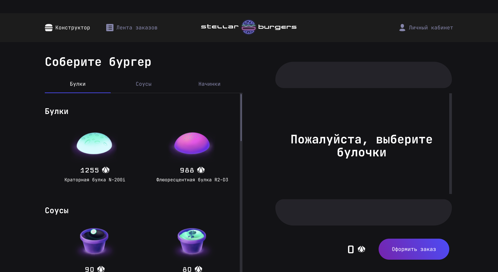

# Stellar burgers - космическая бургерная 

## Tech Stack


## Demo


## Установка зависимостей и запуск проекта

```
# install dependencies
$ npm install

# build project
$ npm run build

# run prod mode
$ npm run start

# run eslint
$ npm run eslint

# run test
```

## Links
* [Link to figma](https://www.figma.com/file/zFGN2O5xktHl9VmoOieq5E/React-_-%D0%9F%D1%80%D0%BE%D0%B5%D0%BA%D1%82%D0%BD%D1%8B%D0%B5-%D0%B7%D0%B0%D0%B4%D0%B0%D1%87%D0%B8_external_link)
* [React Developer Burger UI Components](https://yandex-practicum.github.io/react-developer-burger-ui-components/docs/)